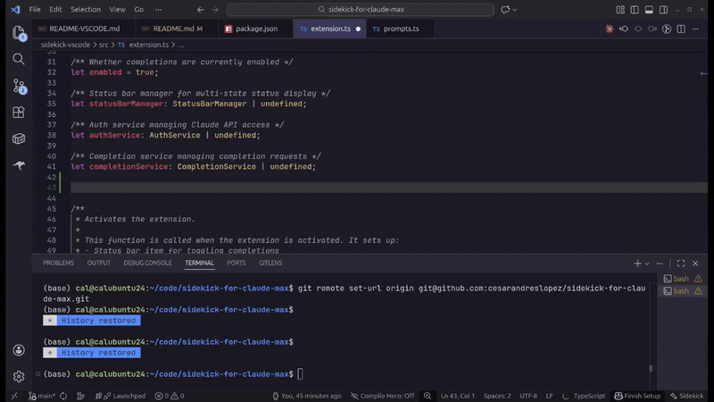
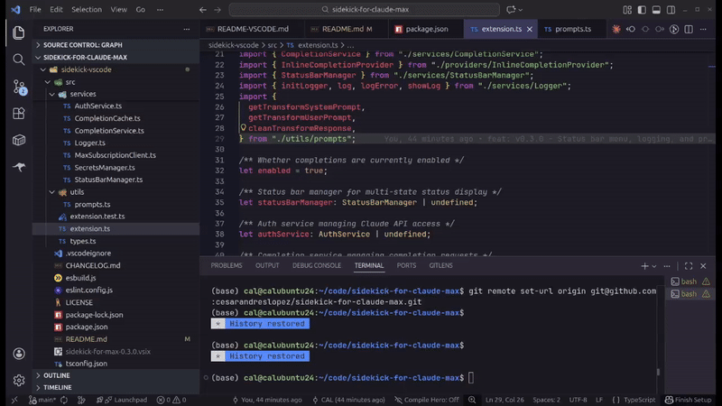
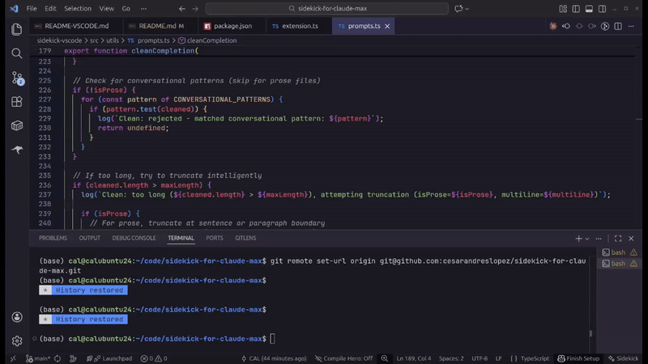
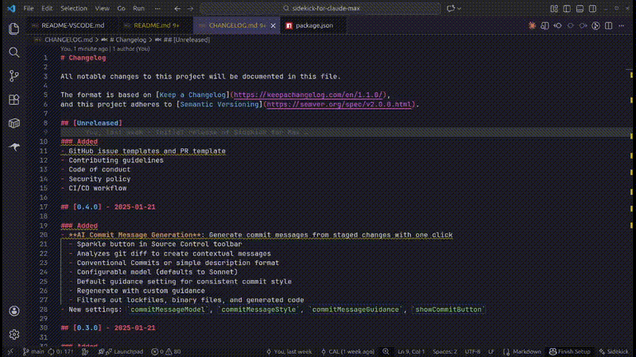
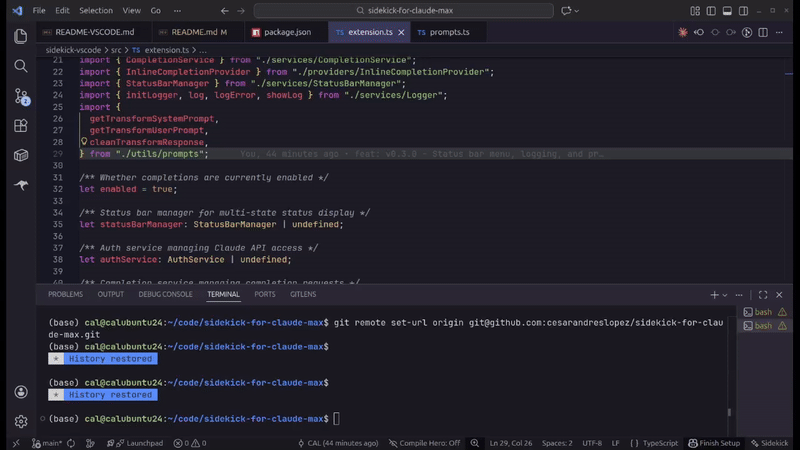

<p align="center">
  
</p>

<h1 align="center">Sidekick for Max</h1>

<p align="center">
  <a href="https://marketplace.visualstudio.com/items?itemName=CesarAndresLopez.sidekick-for-max"></a>
  <a href="https://open-vsx.org/extension/cesarandreslopez/sidekick-for-max"></a>
  <a href="LICENSE"></a>
  <a href="https://github.com/cesarandreslopez/sidekick-for-claude-max/actions/workflows/ci.yml"></a>
</p>

<p align="center">
  AI-powered code completions, transforms, and commit messages for VS Code, using your Claude Max subscription.
</p>

<p align="center">
  
</p>

**Claude Code is incredible for complex, multi-file refactoring and agentic workflows.** But sometimes you just want a quick inline completion while typing, or to transform a snippet of code without spinning up a full conversation. And you shouldn't have to pay for yet another subscription to get that.

If you're already paying for Claude Max, Sidekick lets you use those tokens for inline completions, code transforms, and AI commit messages—no extra cost, no separate account.

Let's consider the following: 

## Why Sidekick for Max?

**Get more value from your Claude Max subscription.** You're paying $100-200/month for Claude Max, but likely have unused capacity in your 5-hour usage windows. Sidekick puts those tokens to work:

- **No additional cost** - Uses your existing Claude Code CLI authentication
- **Complements Claude Code CLI** - CLI excels at agentic multi-file tasks; Sidekick handles quick inline completions and transforms
- **Replace paid alternatives** - Skip the $10-19/month GitHub Copilot subscription; use tokens you're already paying for
- **Lightweight token usage** - Haiku-powered completions are fast and consume minimal quota, leaving room for your CLI workflows

## How It Works

The extension uses the Anthropic SDK directly to call Claude. If you have a Claude Max subscription, it leverages the Claude Code CLI authentication - no API keys needed.

- **Max subscription**: Uses `@anthropic-ai/claude-agent-sdk` via Claude Code CLI auth
- **API key**: Uses `@anthropic-ai/sdk` with your Anthropic API key

## Quick Start

### Prerequisites

- **Claude Max subscription** (Recommended) OR Anthropic API key
- Claude Code CLI installed and authenticated (for Max subscription mode)

> **Why Max subscription is recommended:** Inline completions fire frequently as you type. With an API key, these per-token costs add up quickly. With Max ($100-200/month), you're already paying for the tokens—Sidekick just helps you use your unused capacity. No surprise bills.

### Setup



1. Install and authenticate Claude Code CLI:
   ```bash
   npm install -g @anthropic-ai/claude-code
   claude auth
   ```

2. Install the extension:
   - **VS Code**: Install from the [VS Code Marketplace](https://marketplace.visualstudio.com/items?itemName=CesarAndresLopez.sidekick-for-max)
   - **Cursor/VSCodium**: Install from [Open VSX](https://open-vsx.org/extension/cesarandreslopez/sidekick-for-max) or see [Installing in VS Code Forks](#installing-in-vs-code-forks)

3. Start coding - completions appear automatically as you type

## Features

### Inline Completions
Get intelligent code suggestions as you type. Uses Haiku by default for fast, lightweight completions that won't drain your quota.


### Code Transforms
Select code, press `Ctrl+Shift+M`, and describe how to transform it. Uses Opus by default for high-quality refactoring.



### AI Commit Messages
Generate intelligent commit messages from your staged changes with a single click. Click the sparkle button in the Source Control toolbar to analyze your diff and create a contextual commit message.



- **Conventional Commits** or simple description format
- **Regenerate with guidance** - refine the message with instructions like "focus on the bug fix" or "make it shorter"
- **Default guidance** - configure consistent commit style for your team
- Uses Sonnet by default for high-quality messages

### Status Bar Menu
Click "Sidekick" in the status bar to access logs, test connection, configure settings, and more.



## Token Efficiency

| Feature | Default Model | Token Impact |
|---------|---------------|--------------|
| Inline completions | Haiku | Minimal - fast and cheap |
| Code transforms | Opus | Higher - worth it for quality |
| Commit messages | Sonnet | Moderate - balanced quality and speed |

This design lets you use inline completions freely throughout the day while preserving quota for heavier CLI workflows, transforms, and commit messages.

## Multiple Windows

Each VS Code window runs its own extension instance with independent caches. This means:

- **No shared cache** - Completions cached in one window aren't available in another
- **Independent requests** - Opening the same file in two windows may trigger duplicate API calls
- **Shared authentication** - All windows use the same Claude Code CLI auth or API key

This is standard VS Code extension behavior. For most workflows it's transparent, but be aware that many simultaneous windows could increase token usage.

## Installing in VS Code Forks

The extension works in Cursor, VSCodium, and other VS Code forks.

### Option 1: Open VSX (Recommended)

Install directly from [Open VSX](https://open-vsx.org/extension/cesarandreslopez/sidekick-for-max) - the open marketplace used by Cursor, VSCodium, and other VS Code forks.

### Option 2: Download from GitHub Releases

1. Download the latest `.vsix` file from [Releases](https://github.com/cesarandreslopez/sidekick-for-claude-max/releases)
2. In your editor: Extensions → `...` menu → "Install from VSIX..."
3. Select the downloaded file

### Option 3: Build from Source

```bash
git clone https://github.com/cesarandreslopez/sidekick-for-claude-max.git
cd sidekick-for-claude-max/sidekick-vscode
npm install
npm run package
```

Then install the generated `.vsix` file as above.

### Cursor-Specific Notes

Cursor has its own AI features that may conflict with Sidekick completions. To use Sidekick in Cursor:

1. Disable Cursor's built-in completions in Cursor Settings if you prefer Sidekick's
2. Or use both side-by-side (Sidekick uses your Claude Max tokens, Cursor uses its own)

## Contributing

Contributions are welcome! Whether it's bug fixes, new features, or documentation improvements—all help is appreciated.

See [CONTRIBUTING.md](CONTRIBUTING.md) for setup instructions and guidelines.

## License

MIT
