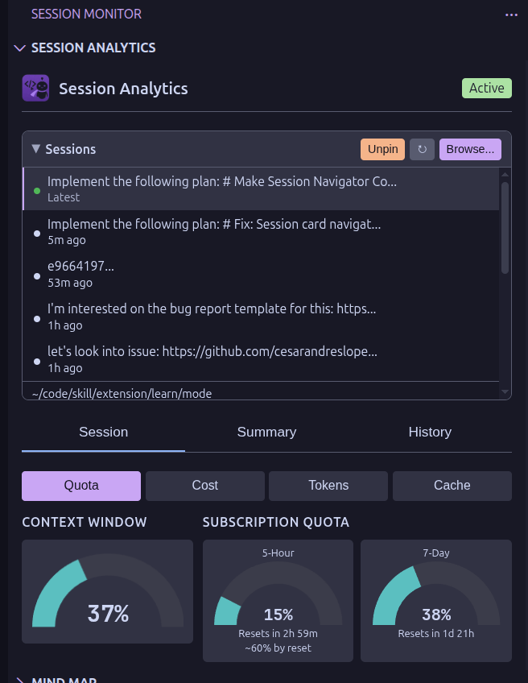

<p align="center">
  
</p>

<h1 align="center">Sidekick for Max</h1>

<p align="center">
  <a href="https://marketplace.visualstudio.com/items?itemName=CesarAndresLopez.sidekick-for-max"></a>
  <a href="https://open-vsx.org/extension/cesarandreslopez/sidekick-for-max"></a>
  <a href="LICENSE"></a>
  <a href="https://github.com/cesarandreslopez/sidekick-for-claude-max/actions/workflows/ci.yml"></a>
</p>

<p align="center">
  Your Claude Max, working harder: completions, transforms, commits, speed reading, and session monitoring.
</p>

<p align="center">
  
</p>

**Claude Code is incredible for complex, multi-file refactoring and agentic workflows.** But sometimes you just want a quick inline completion while typing, or to transform a snippet of code without spinning up a full conversation. And you shouldn't have to pay for yet another subscription to get that.

If you're already paying for Claude Max, Sidekick lets you use those tokens for inline completions, code transforms, AI commit messages, speed reading with AI explanations, and real-time session monitoring—no extra cost, no separate account.

## Why Am I Building This?

Claude Code and other AI agents have transformed how we build software. But some of us are still **control freaks** who want to *see*, *review*, and *understand* everything that our overly-enthusiastic robot assistant does with our code. We also enjoy writing actual code ourselves sometimes. And since agents love to be verbose, we need to **ingest their output faster** (hence RSVP speed reading).

Sidekick gives you visibility into what Claude is doing, quick AI assistance for the small stuff, and tools to read faster—all without leaving VS Code.

## Why Sidekick for Max?

**Stop paying twice for AI coding tools.** You're already spending $100-200/month on Claude Max. Sidekick lets you drop your $10-19/month Copilot subscription and get completions, transforms, and session monitoring from the same plan:

- **Replace GitHub Copilot** - Inline completions powered by Haiku are fast and consume minimal quota, so even heavy Claude Code users can run them freely
- **Monitor your Claude Code sessions** - Real-time dashboard showing token usage, costs, activity timeline, and what Claude is doing in your codebase—especially valuable if you're burning through quota and want to know where it's going
- **No additional cost** - Uses your existing Claude Code CLI authentication
- **Complements Claude Code CLI** - CLI excels at agentic multi-file tasks; Sidekick handles quick inline completions and transforms

## How It Works

The extension uses the Anthropic SDK directly to call Claude. If you have a Claude Max subscription, it leverages the Claude Code CLI authentication - no API keys needed.

- **Max subscription**: Uses `@anthropic-ai/claude-agent-sdk` via Claude Code CLI auth
- **API key**: Uses `@anthropic-ai/sdk` with your Anthropic API key

## Quick Start

### Prerequisites

- **Claude Max subscription** (Recommended) OR Anthropic API key
- Claude Code CLI installed and authenticated (for Max subscription mode)

> **Why Max subscription is recommended:** Inline completions fire frequently as you type. With an API key, these per-token costs add up quickly. With Max ($100-200/month), completions are covered by your existing plan—no surprise bills. Haiku-powered completions are lightweight enough that they won't meaningfully impact your Claude Code quota.

### Setup


1. Install and authenticate Claude Code CLI:
   ```bash
   npm install -g @anthropic-ai/claude-code
   claude auth
   ```

2. Install the extension:
   - **VS Code**: Install from the [VS Code Marketplace](https://marketplace.visualstudio.com/items?itemName=CesarAndresLopez.sidekick-for-max)
   - **Cursor/VSCodium**: Install from [Open VSX](https://open-vsx.org/extension/cesarandreslopez/sidekick-for-max) or see [Installing in VS Code Forks](#installing-in-vs-code-forks)

3. Start coding - completions appear automatically as you type

## Features

### Claude Code Session Monitor
Monitor your Claude Code sessions in real-time with a comprehensive analytics dashboard. Click the Session Monitor icon in the activity bar to access all monitoring features.


- **Session Analytics Dashboard** - Track token usage, costs, and activity in real-time
  - Token usage with explanatory tooltips and quota projections showing estimated usage at reset
  - Context window gauge showing input/output usage vs. limits
  - Activity timeline with user prompts, tool calls, and errors
  - Collapsible session navigator to save vertical space when not switching sessions
  - Session selector to switch between active sessions


  - Tool analytics showing what operations Claude is performing
  - **Session Summary** with AI narrative generation and progress feedback
  - Organized Session tab with three collapsible groups: Session Activity, Performance & Cost, Tasks & Recovery


- **Mind Map Visualization** - Interactive D3.js graph showing session structure
  - Visualizes conversation flow and file relationships
  - Real-time updates as the session progresses


- **Kanban Board** - TaskCreate/TaskUpdate tasks grouped by status
  - Collapsible columns with hidden-task summaries
  - Real-time updates as tasks move through the workflow


- **Latest Files Touched** - Tree view of files modified during sessions
- **Subagents Tree** - Monitor spawned Task agents during complex operations
- **Status Bar Metrics** - Quick session status in the VS Code status bar
- **CLAUDE.md Suggestions** - AI-powered analysis of your session patterns
  - Detects recovery patterns (when Claude gets stuck and how it recovers)
  - Generates best practices based on actual usage
  - Collapsible suggestions panel with progress indicators


The monitor automatically discovers Claude Code sessions and updates in real-time as Claude works. Perfect for understanding token usage and keeping an eye on costs.

### Inline Completions
Get intelligent code suggestions as you type. Uses Haiku by default for fast, lightweight completions that won't drain your quota.


### Code Transforms
Select code, press `Ctrl+Shift+M`, and describe how to transform it. Uses Opus by default for high-quality refactoring.


### Quick Ask (Inline Chat)
Ask questions about code or request changes without leaving your editor. Press `Ctrl+I` (Cmd+I on Mac) to open the quick input.

- **Context-aware** - uses selected code or cursor context
- **Ask questions** - "What does this function do?" or "Is this thread-safe?"
- **Request changes** - "Add error handling" or "Convert to async/await"
- **Diff preview** - review proposed changes before accepting
- Uses Sonnet by default for balanced quality

### Generate Documentation
Automatically generate JSDoc/docstrings for functions, classes, and methods. Place your cursor in a function and press `Ctrl+Shift+D` (Cmd+Shift+D on Mac).

- Supports TypeScript, JavaScript, Python, and more
- Generates parameter descriptions, return types, and examples
- Uses Haiku by default for fast generation

### Explain Code
Get AI-powered explanations for selected code. Select code and press `Ctrl+Shift+E` (Cmd+Shift+E on Mac).

- **Five complexity levels**: ELI5, Curious Amateur, Imposter Syndrome, Senior, PhD Mode
- **Rich webview panel** with markdown rendering
- **Regenerate** with custom instructions for different perspectives
- **Read in RSVP** - speed read explanations with one click
- Uses Sonnet by default for quality explanations

### Error Explanations & Fixes
Understand and fix errors with AI assistance. Click the lightbulb on any diagnostic or use the context menu.

- **Explain Error** - understand what went wrong and why
- **Fix Error** - get a suggested fix applied directly to your code
- **Five complexity levels** for explanations
- Uses Sonnet by default for accurate analysis

### AI Commit Messages
Generate intelligent commit messages from your staged changes with a single click. Click the sparkle button in the Source Control toolbar to analyze your diff and create a contextual commit message.


- **Conventional Commits** or simple description format
- **Regenerate with guidance** - refine the message with instructions like "focus on the bug fix" or "make it shorter"
- **Default guidance** - configure consistent commit style for your team
- Uses Sonnet by default for high-quality messages

### Pre-commit AI Review
Review your changes before committing. Click the eye icon in the Source Control toolbar to get AI feedback on your staged changes.

- **Bug detection** - catches potential issues before they're committed
- **Security concerns** - highlights potential vulnerabilities
- **Code smells** - identifies maintainability issues
- **Inline decorations** - issues shown directly in the editor
- Uses Sonnet by default for thorough analysis

### PR Description Generation
Generate pull request descriptions automatically. Click the PR icon in the Source Control toolbar.

- **Analyzes all commits** on your branch vs the base branch
- **Generates summary** - high-level overview of changes
- **Lists changes** - detailed breakdown by area
- **Test plan** - suggested testing checklist
- **Copies to clipboard** - ready to paste into GitHub/GitLab
- Uses Sonnet by default for comprehensive descriptions

### RSVP Reader
Speed read selected text with AI-powered explanations. [RSVP (Rapid Serial Visual Presentation)](https://en.wikipedia.org/wiki/Rapid_serial_visual_presentation) displays words one at a time at a fixed focal point, eliminating eye movement and enabling reading speeds of 2-3x normal. Select text, press `Ctrl+Shift+R`, and read faster with ORP (Optimal Recognition Point) highlighting.


- **Word-by-word display** with ORP highlighting for reduced eye movement
- **Adjustable speed** from 100-900 WPM
- **AI explanations** at five complexity levels: ELI5, Curious Amateur, Imposter Syndrome, Senior, PhD Mode
- **Dual modes** - toggle between RSVP and full-text view, switch between original and explanation
- **Keyboard controls** - Space (play/pause), arrows (navigate/speed), R (restart), F (full-text)
- Uses Sonnet by default for intelligent explanations

### Status Bar Menu
Click "Sidekick" in the status bar to access logs, test connection, configure settings, and more.


## Token Efficiency

| Feature | Default Model | Token Impact |
|---------|---------------|--------------|
| Inline completions | Haiku | Minimal - fast and cheap |
| Generate documentation | Haiku | Minimal - fast generation |
| Code transforms | Opus | Higher - worth it for quality |
| Quick Ask | Sonnet | Moderate - balanced quality |
| Explain Code | Sonnet | Moderate - on-demand only |
| Error explanations | Sonnet | Moderate - on-demand only |
| Commit messages | Sonnet | Moderate - balanced quality and speed |
| Pre-commit review | Sonnet | Moderate - thorough analysis |
| PR descriptions | Sonnet | Moderate - one-time generation |
| RSVP explanations | Sonnet | Moderate - on-demand only |

This design lets you use inline completions freely throughout the day while preserving quota for heavier CLI workflows, transforms, and commit messages.

## Multiple Windows

Each VS Code window runs its own extension instance with independent caches. This means:

- **No shared cache** - Completions cached in one window aren't available in another
- **Independent requests** - Opening the same file in two windows may trigger duplicate API calls
- **Shared authentication** - All windows use the same Claude Code CLI auth or API key

This is standard VS Code extension behavior. For most workflows it's transparent, but be aware that many simultaneous windows could increase token usage.

## Installing in VS Code Forks

The extension works in Cursor, VSCodium, and other VS Code forks.

### Option 1: Open VSX (Recommended)

Install directly from [Open VSX](https://open-vsx.org/extension/cesarandreslopez/sidekick-for-max) - the open marketplace used by Cursor, VSCodium, and other VS Code forks.

### Option 2: Download from GitHub Releases

1. Download the latest `.vsix` file from [Releases](https://github.com/cesarandreslopez/sidekick-for-claude-max/releases)
2. In your editor: Extensions → `...` menu → "Install from VSIX..."
3. Select the downloaded file

### Option 3: Build from Source

```bash
git clone https://github.com/cesarandreslopez/sidekick-for-claude-max.git
cd sidekick-for-claude-max/sidekick-vscode
npm install
npm run package
```

Then install the generated `.vsix` file as above.

### Cursor-Specific Notes

Cursor has its own AI features that may conflict with Sidekick completions. To use Sidekick in Cursor:

1. Disable Cursor's built-in completions in Cursor Settings if you prefer Sidekick's
2. Or use both side-by-side (Sidekick uses your Claude Max tokens, Cursor uses its own)

## Contributing

Contributions are welcome! Whether it's bug fixes, new features, or documentation improvements—all help is appreciated.

See [CONTRIBUTING.md](CONTRIBUTING.md) for setup instructions and guidelines.

## License

MIT
