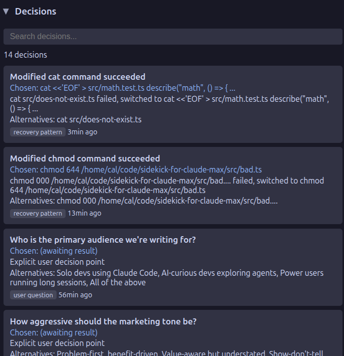

# Decision Log

During long sessions, your agent makes architectural decisions — choosing a library, picking a design pattern, settling on an API structure. These decisions are buried in conversation history and lost when the session ends. The decision log extracts and persists them, so you (and future sessions) can reference why things were done a certain way.

Tracks and persists architectural decisions extracted from coding sessions.

## How It Works

Sidekick monitors session activity for decision-related patterns and extracts them into a persistent log stored per-project.

## Storage

Decision logs are stored in `~/.config/sidekick/decisions/{projectSlug}.json` and persist across sessions.

!!! tip "Why persistence matters"
    When a session ends, everything in context is gone. Because decisions are persisted to disk, future sessions — and [handoff documents](session-handoff.md) — can reference them automatically. See the [Context Management primer](../getting-started/context-management.md) for more on how context and session boundaries work.
