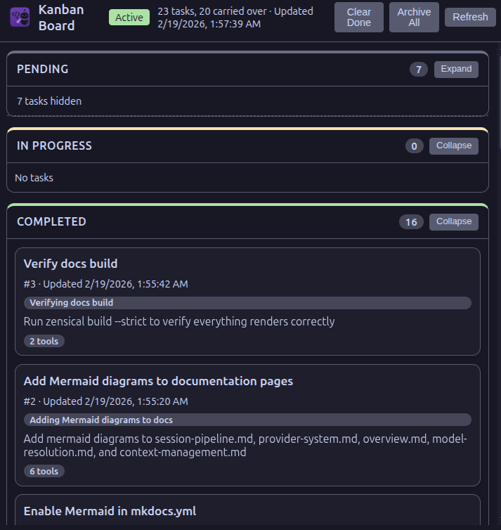

# Kanban Board

When your agent spawns subagents to work in parallel — exploring options, planning implementations, running commands — it's hard to track what's happening. The Kanban board shows every task and subagent grouped by status, so you can see progress at a glance during complex operations.

Tasks and subagent spawns grouped by status in a dedicated Kanban view.

## Features

- **Status Columns** — tasks grouped by Pending, In Progress, and Completed
- **Real-time Updates** — board updates as tasks and agents progress
- **Subagent Cards** — spawned Task agents shown with cyan accent and type chips (Explore, Plan, Bash, etc.)
- **Collapsible Columns** — collapse columns with hidden-task summaries
- **Cross-Session Persistence** — tasks persist across sessions in `~/.config/sidekick/tasks/`
- **Header Summary** — shows separate counts (e.g., "3 tasks, 2 agents")

## Subagent Tracking

When your agent spawns subagents via the Task tool:

- Each subagent creates an "In Progress" card with the agent's description
- Cards show agent type (Explore, Plan, Bash, etc.)
- Cards move to "Completed" when the subagent finishes
- Visually distinguished from regular tasks with a cyan left border
