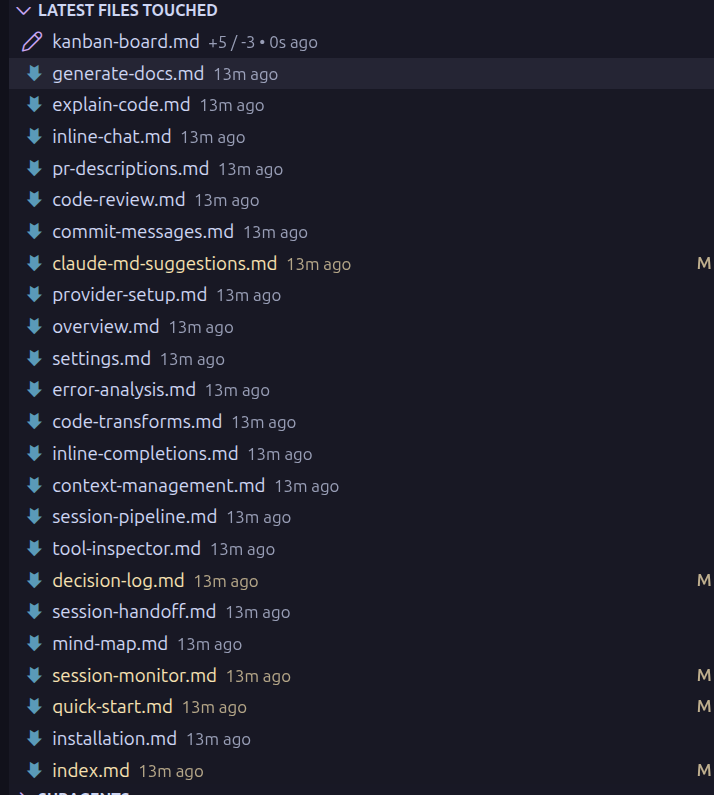

# Mind Map

Agent sessions can be complex — dozens of tool calls, multiple files touched, subagents spawned. The mind map visualizes the entire session as an interactive graph, so you can trace how your agent navigated the codebase and understand its approach. Especially useful for debugging sessions that went off track.

Interactive D3.js force-directed graph showing session structure and relationships.

## Features

- **Conversation Flow** — visualizes the progression of the session
- **File Relationships** — shows which files your agent is working with
- **Tool Usage** — displays tool calls as connected nodes
- **URL Nodes** — WebFetch and WebSearch calls appear as clickable cyan nodes
- **Directory & Command Nodes** — Grep/Glob targets and Bash commands shown
- **Subagent Visibility** — spawned Task agents appear as distinct nodes
- **Plan Nodes** — plan steps with status indicators
- **Dynamic Node Sizing** — nodes scale based on content length
- **Latest Link Highlighting** — most recent connections are visually emphasized
- **Auto-Focus on Activity** — map pans to show new activity while preserving zoom
- **Real-time Updates** — graph updates as the session progresses

## Interaction

- **Click file nodes** to open them in VS Code
- **Click URL nodes** to open in your browser
- **Click search nodes** to search Google
- **Drag nodes** to rearrange the layout
- **Reset Layout** button rebuilds the D3 simulation and recenters

## Line Change Statistics

File nodes and the Files Touched tree view show `+/-` line change counts for modified files.

