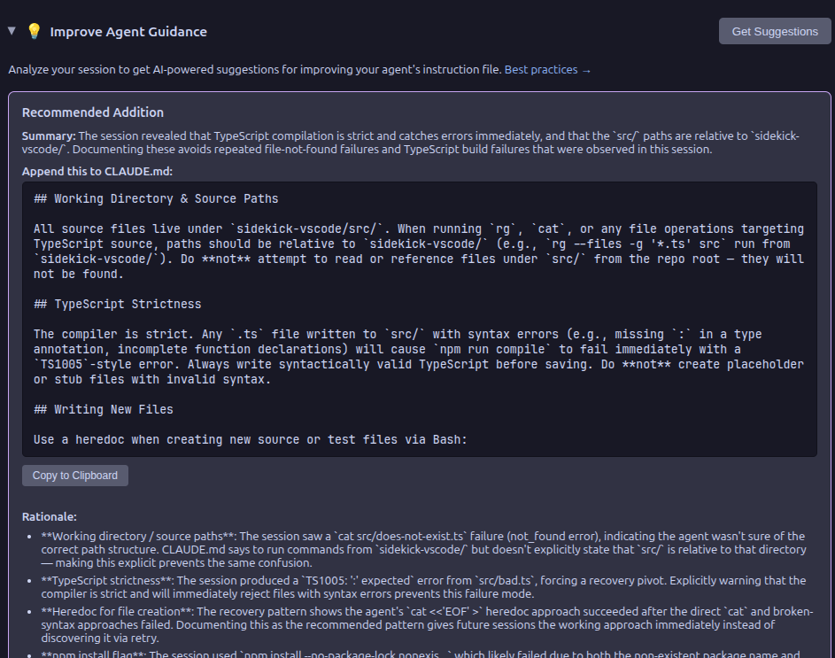

# Sidekick Agent Hub

  

**AI coding assistant with real-time agent monitoring for VS Code** — inline completions, code transforms, commit messages, and agent session monitoring.

## What Sidekick Does For You

**Code faster.** AI handles the mechanical work — boilerplate, commit messages, docs, PR descriptions, error explanations — so you focus on design and logic. Inline completions understand your project context, not just syntax.

**Stay in control.** When AI agents run autonomously, tokens burn silently and context fills up without warning. Sidekick's real-time dashboards, mind maps, and notification triggers give you visibility into what your agent is doing, so you can catch problems before you hit limits.

**Never lose context.** Sessions end and everything is lost — decisions, progress, architectural choices. Session handoff and decision logging preserve that context automatically, so your next session picks up where you left off instead of re-discovering everything.

## Why Am I Building This?

AI coding agents are the most transformative tools I've used in my career. They can scaffold entire features, debug problems across files, and handle the mechanical parts of software engineering that used to eat hours of every day.

But they're also opaque. Tokens burn in the background with no visibility. Context fills up silently until your agent starts forgetting things. And when a session ends, everything it learned — your architecture, your conventions, the decisions you made together — is just gone. The next session starts from zero.

That bothers me. I want to see what my agent is doing. I want to review every tool call, understand where my tokens went, and carry context forward instead of losing it. Sidekick exists because I think the people using these agents deserve visibility into how they work — not just the output, but the process.

## Supported Providers

| Provider | Inference | Session Monitoring | Cost |
|----------|-----------|-------------------|------|
| **Claude Max** | :white_check_mark: | :white_check_mark: | Included in subscription |
| **Claude API** | :white_check_mark: | :x: | Per-token billing |
| **OpenCode** | :white_check_mark: | :white_check_mark: | Depends on configured provider |
| **Codex CLI** | :white_check_mark: | :white_check_mark: | OpenAI API billing |

## Feature Highlights

- **Inline Completions** — context-aware suggestions that understand your project, not just syntax
- **Code Transforms** — select code, describe changes in natural language
- **AI Commit Messages** — meaningful messages generated from your actual diff
- **Session Monitor** — see exactly where your tokens are going before you hit quota limits
- **Mind Map** — trace how your agent navigated the codebase during a session
- **Kanban Board** — track tasks and subagents at a glance during complex operations
- **Quick Ask** — inline chat for questions and code changes without switching context
- **Code Review** — catch bugs and security concerns before they reach your team
- **PR Descriptions** — structured summaries from branch diff, ready to paste
- **Error Analysis** — understand what went wrong, why, and how to fix it
- **Session Handoff** — pick up where you left off instead of re-discovering everything
- **CLAUDE.md Suggestions** — learn from session patterns to improve agent effectiveness

## Quick Install

Install from the [VS Code Marketplace](https://marketplace.visualstudio.com/items?itemName=CesarAndresLopez.sidekick-for-max) or [Open VSX](https://open-vsx.org/extension/cesarandreslopez/sidekick-for-max).

Then see [Getting Started](getting-started/installation.md) for provider setup.

## Contributing

Contributions welcome! See the [Contributing Guide](contributing.md).

## Community

If Sidekick is useful to you, a [star on GitHub](https://github.com/cesarandreslopez/sidekick-agent-hub) helps others find it.

Found a bug or have a feature idea? [Open an issue](https://github.com/cesarandreslopez/sidekick-agent-hub/issues) — all feedback is welcome.

## License

MIT
